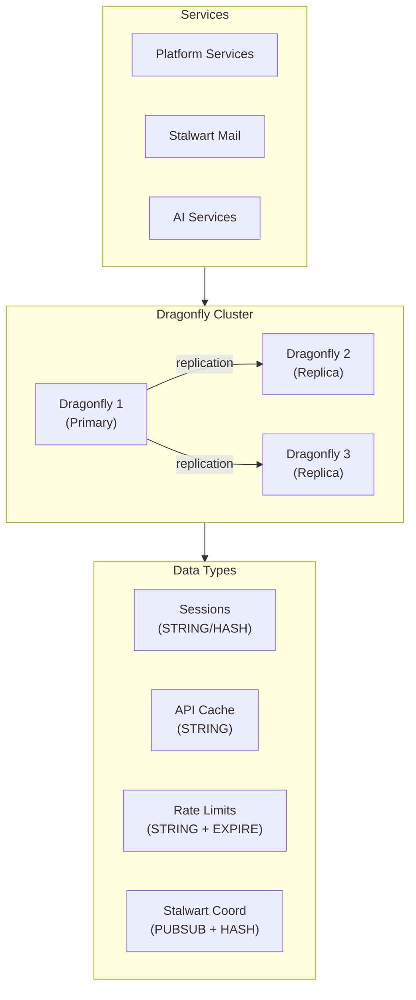

# ADR-027: Caching Layer - Dragonfly

## Status
**Accepted**

## Date
2026-01-07

## Context

Talent Mesh requires an in-memory data store for:
- Session caching
- API response caching
- Rate limiting counters
- Stalwart mail server coordination
- Temporary data storage

Options considered:

1. **Redis**: Original, industry standard
2. **Valkey**: Redis fork (Linux Foundation, BSD license)
3. **Dragonfly**: Modern Redis replacement (multi-threaded)
4. **KeyDB**: Multi-threaded Redis fork

## Decision

We will use **Dragonfly** as the caching layer.

### Why Dragonfly Over Valkey/Redis

| Factor | Dragonfly | Valkey | Redis |
|--------|-----------|--------|-------|
| **Architecture** | Multi-threaded (shared-nothing) | Single-threaded | Single-threaded |
| **Memory efficiency** | **30-40% less** | Baseline | Baseline |
| **Throughput** | **~3.8M ops/s** | ~1.2M ops/s | ~1M ops/s |
| **Snapshot overhead** | **No fork (consistent)** | Fork (2x spike) | Fork (2x spike) |
| **Redis compatibility** | ~100% | 100% | 100% |
| **License** | BSL 1.1 → Apache 2.0 | BSD 3-clause | AGPLv3 |
| **CPU scaling** | ✅ Linear | ❌ Single-thread bottleneck | ❌ Same |

### Memory Comparison

```
Memory usage for 50M items:
┌────────────────────────────────────────────────────────────┐
│ Redis/Valkey: ████████████████████████████████  3.77 GB    │
│ Dragonfly:    ████████████████████████          2.72 GB    │
│                                                  -28%      │
└────────────────────────────────────────────────────────────┘

Memory per sorted set entry (ZADD):
┌────────────────────────────────────────────────────────────┐
│ Valkey:    ████████████████████████  23.1 KiB              │
│ Dragonfly: █████████████             12.6 KiB (-45%)       │
└────────────────────────────────────────────────────────────┘
```

### Why Memory Efficiency Matters

With only **24GB RAM** across 3 nodes, every MB counts:

| Scenario | Valkey | Dragonfly | Savings |
|----------|--------|-----------|---------|
| Session cache (100K sessions) | ~150MB | ~100MB | 50MB |
| Rate limit counters | ~50MB | ~35MB | 15MB |
| API cache | ~200MB | ~140MB | 60MB |
| Stalwart coordination | ~50MB | ~35MB | 15MB |
| **Total** | ~450MB | ~310MB | **140MB** |

Plus: Valkey needs +50% headroom for snapshots = **~675MB** vs Dragonfly's **~310MB**.

### Architecture



### Dragonfly Cluster Configuration

```yaml
# dragonfly-values.yaml
replicaCount: 3

resources:
  requests:
    memory: "256Mi"
    cpu: "100m"
  limits:
    memory: "512Mi"
    cpu: "500m"

# Dragonfly-specific settings
extraArgs:
  - --cluster_mode=emulated  # Redis Cluster compatibility
  - --maxmemory=400mb
  - --maxmemory-policy=allkeys-lru
  - --snapshot_cron="0 */6 * * *"  # Snapshot every 6 hours
  - --dir=/data
  - --dbfilename=dump.rdb

persistence:
  enabled: true
  size: 5Gi
  storageClass: local-path

# High availability
podAntiAffinity:
  requiredDuringSchedulingIgnoredDuringExecution:
  - labelSelector:
      matchLabels:
        app: dragonfly
    topologyKey: kubernetes.io/hostname
```

### Kubernetes Deployment

```yaml
apiVersion: apps/v1
kind: StatefulSet
metadata:
  name: dragonfly
  namespace: cache
spec:
  serviceName: dragonfly
  replicas: 3
  selector:
    matchLabels:
      app: dragonfly
  template:
    metadata:
      labels:
        app: dragonfly
    spec:
      affinity:
        podAntiAffinity:
          requiredDuringSchedulingIgnoredDuringExecution:
          - labelSelector:
              matchLabels:
                app: dragonfly
            topologyKey: kubernetes.io/hostname
      containers:
      - name: dragonfly
        image: docker.dragonflydb.io/dragonflydb/dragonfly:latest
        args:
        - --cluster_mode=emulated
        - --maxmemory=400mb
        - --maxmemory-policy=allkeys-lru
        ports:
        - containerPort: 6379
        resources:
          requests:
            memory: "256Mi"
            cpu: "100m"
          limits:
            memory: "512Mi"
            cpu: "500m"
        volumeMounts:
        - name: data
          mountPath: /data
  volumeClaimTemplates:
  - metadata:
      name: data
    spec:
      accessModes: ["ReadWriteOnce"]
      storageClass: local-path
      resources:
        requests:
          storage: 5Gi
```

### Service Configuration

```yaml
apiVersion: v1
kind: Service
metadata:
  name: dragonfly
  namespace: cache
spec:
  type: ClusterIP
  ports:
  - port: 6379
    targetPort: 6379
  selector:
    app: dragonfly
---
# Headless service for StatefulSet DNS
apiVersion: v1
kind: Service
metadata:
  name: dragonfly-headless
  namespace: cache
spec:
  type: ClusterIP
  clusterIP: None
  ports:
  - port: 6379
  selector:
    app: dragonfly
```

### Usage Examples

```typescript
import { createClient } from 'redis';

// Dragonfly is Redis-compatible
const client = createClient({
  url: 'redis://dragonfly:6379',
});

await client.connect();

// Session caching
await client.hSet(`session:${sessionId}`, {
  userId: user.id,
  linkedinId: user.linkedinId,
  createdAt: Date.now().toString(),
});
await client.expire(`session:${sessionId}`, 86400);  // 24 hours

// API response caching
await client.setEx(
  `cache:user:${userId}`,
  300,  // 5 minutes
  JSON.stringify(userProfile)
);

// Rate limiting
const key = `ratelimit:${ip}:${endpoint}`;
const count = await client.incr(key);
if (count === 1) {
  await client.expire(key, 60);  // 1 minute window
}
if (count > 100) {
  throw new RateLimitError();
}
```

### Stalwart Integration

Stalwart uses Dragonfly for cluster coordination:

```yaml
# stalwart.yaml
cluster:
  coordination:
    type: redis
    url: redis://dragonfly:6379
```

### Monitoring

Dragonfly exposes Prometheus-compatible metrics:

```yaml
# Key metrics
- dragonfly_used_memory_bytes
- dragonfly_connected_clients
- dragonfly_commands_processed_total
- dragonfly_keyspace_hits_total
- dragonfly_keyspace_misses_total
- dragonfly_evicted_keys_total
```

### Resource Requirements

| Component | Instances | Memory | CPU | Storage |
|-----------|-----------|--------|-----|---------|
| Dragonfly | 3 | ~256MB each | 100m each | 5Gi each |
| **Total** | | **~768MB** | ~300m | 15Gi |

**Note:** This is ~768MB with limits, but actual usage will be ~310MB based on our workload.

## Consequences

### Positive

1. **30-40% less memory**: Critical for our 24GB cluster
2. **No fork overhead**: Consistent memory usage during snapshots
3. **Redis compatible**: Drop-in replacement, existing code works
4. **Multi-threaded**: Better CPU utilization on multi-core nodes
5. **Stalwart compatible**: Works as coordination backend

### Negative

1. **BSL license**: Converts to Apache 2.0 after 3 years
2. **Newer project**: Less battle-tested than Redis
3. **Some edge cases**: ~99% Redis compatibility (rare edge cases)

### Mitigations

- BSL is permissive for self-hosted (only restricts competing SaaS)
- Dragonfly is production-ready (used by large companies)
- Test Redis commands used by our services in staging

## Migration from Redis

```typescript
// Connection string change only
// Before
const client = createClient({ url: 'redis://redis:6379' });

// After
const client = createClient({ url: 'redis://dragonfly:6379' });

// All Redis commands work the same
```

## References

- [Dragonfly Documentation](https://www.dragonflydb.io/docs)
- [Dragonfly vs Valkey Benchmark](https://www.dragonflydb.io/blog/dragonfly-vs-valkey-benchmark-on-google-cloud)
- [Dragonfly Memory Efficiency](https://www.dragonflydb.io/blog/scaling-performance-redis-vs-dragonfly)
- [Dragonfly GitHub](https://github.com/dragonflydb/dragonfly)

---

*ADR Version: 1.0*
*Last Updated: 2026-01-07*
