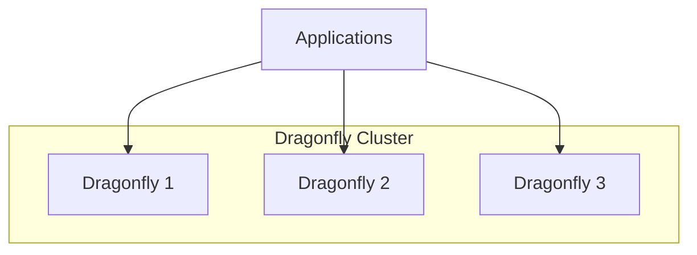
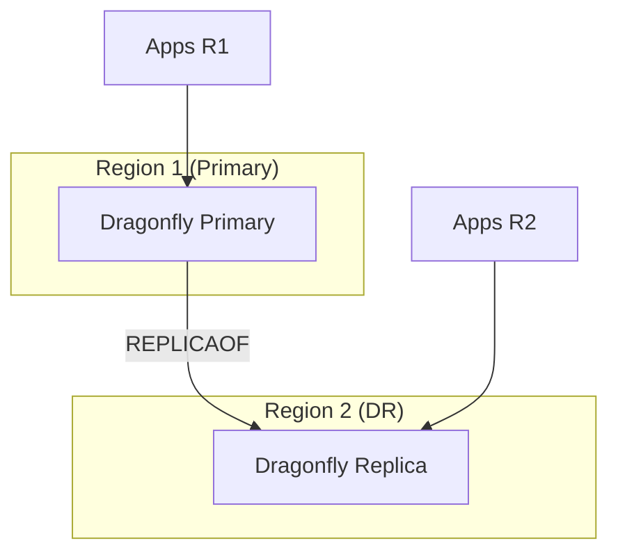

# ADR: Caching with Dragonfly

**Status:** Accepted
**Date:** 2024-05-01
**Updated:** 2026-01-16

## Context

Need in-memory cache for sessions, rate limiting, and ephemeral data with multi-region replication support.

## Decision

Use **Dragonfly** as Redis-compatible cache with REPLICAOF for cross-region DR.

## Architecture

### Single Region



### Multi-Region DR (REPLICAOF)



## DR Strategy: REPLICAOF

Dragonfly supports Redis REPLICAOF for async replication:

```bash
# On DR region Dragonfly
REPLICAOF primary-dragonfly.region1.svc.cluster.local 6379
```

### Characteristics

| Aspect | Value |
|--------|-------|
| Replication | Asynchronous |
| Lag | Milliseconds to seconds |
| Consistency | Eventual |
| Failover | Manual promotion |

### Failover

```bash
# On DR region Dragonfly (to promote)
REPLICAOF NO ONE
```

## Rationale

| Option | Memory Efficiency | Compatibility | DR Support |
|--------|-------------------|---------------|------------|
| Redis OSS | Baseline | 100% | REPLICAOF |
| **Dragonfly** | 30-40% better | 100% | REPLICAOF | **Selected** |
| Redis Cluster | Baseline | 100% | Complex |
| KeyDB | Better | 99% | REPLICAOF |

**Key Decision Factors:**
- 100% Redis compatibility
- 30-40% more memory efficient
- Multi-threaded performance
- Simple REPLICAOF for DR
- No cluster mode complexity

## Configuration

### Primary Region

```yaml
apiVersion: apps/v1
kind: StatefulSet
metadata:
  name: dragonfly
  namespace: databases
spec:
  replicas: 1  # Single primary for replication
  template:
    spec:
      containers:
        - name: dragonfly
          image: docker.dragonflydb.io/dragonflydb/dragonfly:latest
          args:
            - --requirepass=$(REDIS_PASSWORD)
            - --maxmemory=2gb
            - --cache_mode=true
          ports:
            - containerPort: 6379
          env:
            - name: REDIS_PASSWORD
              valueFrom:
                secretKeyRef:
                  name: dragonfly-credentials
                  key: password
```

### DR Region (Replica)

```yaml
apiVersion: apps/v1
kind: StatefulSet
metadata:
  name: dragonfly
  namespace: databases
spec:
  replicas: 1
  template:
    spec:
      containers:
        - name: dragonfly
          image: docker.dragonflydb.io/dragonflydb/dragonfly:latest
          args:
            - --requirepass=$(REDIS_PASSWORD)
            - --maxmemory=2gb
            - --cache_mode=true
            - --replicaof=dragonfly.region1.<domain>:6379
            - --masterauth=$(MASTER_PASSWORD)
          env:
            - name: REDIS_PASSWORD
              valueFrom:
                secretKeyRef:
                  name: dragonfly-credentials
                  key: password
            - name: MASTER_PASSWORD
              valueFrom:
                secretKeyRef:
                  name: dragonfly-credentials
                  key: master-password
```

## Use Cases

| Use Case | TTL | Eviction | DR Needed |
|----------|-----|----------|-----------|
| Session cache | 24h | LRU | Yes |
| Rate limiting | 1m | Fixed | No (local) |
| API cache | 5m | LRU | Optional |
| Feature flags | 1m | LRU | Yes |

## Monitoring

| Metric | Description |
|--------|-------------|
| `dragonfly_connected_replicas` | Number of connected replicas |
| `dragonfly_replication_lag` | Replication lag in bytes |
| `dragonfly_used_memory` | Memory usage |

## Consequences

**Positive:**
- Memory efficiency (30-40% better than Redis)
- Redis compatibility
- Simple REPLICAOF for DR
- Multi-threaded performance

**Negative:**
- Newer project, smaller community
- Async replication (potential data loss on failover)
- Manual failover required

## Related

- [ADR-MULTI-REGION-STRATEGY](../../handbook/docs/adrs/ADR-MULTI-REGION-STRATEGY.md)
